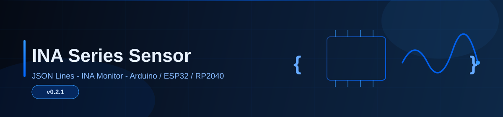

<p align="center">
  
</p>

<h1 align="center">INA Series Sensor</h1>

<p align="center">
  <strong>All-in-one Arduino library for Texas Instruments INA-series current / voltage / power monitors</strong>
</p>

<p align="center">
  <a href="#supported-chips">26 chips</a> ·
  <a href="#features">Two modes</a> ·
  <a href="docs/API.md">API Reference</a> ·
  <a href="docs/USAGE.md">User Guide</a> ·
  <a href="https://github.com/dunknowcoding/NiusRobotLab_INA_monitor">INA Monitor Tool</a>
</p>

---

## Features

| | |
|---|---|
| **Broad chip coverage** | INA219, INA220, INA226, INA228, INA229 (SPI), INA230–239, INA740X, INA3221, INA2227, INA4230, INA4235 — including Q1 automotive variants |
| **Two usage modes** | **JSONL streaming** for the [NiusRobotLab_INA_monitor](https://github.com/dunknowcoding/NiusRobotLab_INA_monitor) desktop tool, **or** standalone direct-read API for your own code — both can be combined |
| **Multi-platform** | Arduino AVR, ESP32 / ESP8266, RP2040 / RP2350, SAMD, STM32, megaAVR, Renesas — `architectures=*` |
| **Per-channel control** | INA3221 triple-channel: independent shunt resistor, enable/disable, per-channel reading |
| **Advanced sensing** | INA228/229: die temperature, energy accumulation, charge accumulation |
| **69 ready-to-flash examples** | Basic, advanced (temperature/energy), and alert-interrupt examples for every supported chip |

## Quick Start

### Install

**Arduino IDE:** Sketch → Include Library → Add .ZIP Library → select the downloaded `.zip`.

**PlatformIO:** Add to `platformio.ini`:
```ini
lib_deps = dunknowcoding/INA Series Sensor
```

### Mode A — JSONL Streaming (with INA Monitor)

```cpp
#include <INA_Series_Sensor.h>

static InaBridge228 sensor("INA228", 0x40);

void setup() {
  Serial.begin(115200);
  sensor.begin(8, 9);  // SDA, SCL
}

void loop() {
  sensor.tick();  // Responds to START/STOP/SR commands from INA Monitor
}
```

Open [NiusRobotLab_INA_monitor](https://github.com/dunknowcoding/NiusRobotLab_INA_monitor), connect the serial port, and click **Start** to see real-time voltage / current / power graphs.

### Mode B — Standalone Direct Reading

```cpp
#include <INA_Series_Sensor.h>

static InaBridge228 sensor("INA228", 0x40);

void setup() {
  Serial.begin(115200);
  sensor.begin(8, 9);
  sensor.setRshunt(0.1);  // 100 mΩ shunt
  sensor.setImax(10.0);   // 10 A max
}

void loop() {
  if (sensor.dataReady()) {
    float voltage = sensor.readBusVoltage();  // V
    float current = sensor.readCurrent();     // A
    float power   = sensor.readPower();       // W
    float temp    = sensor.readDieTemp();     // °C (INA228 only)

    Serial.print("V="); Serial.print(voltage, 3);
    Serial.print(" I="); Serial.print(current, 4);
    Serial.print(" P="); Serial.print(power, 4);
    Serial.print(" T="); Serial.println(temp, 1);
  }
  delay(100);
}
```

### INA3221 — Multi-Channel

```cpp
static InaBridge3221 sensor("INA3221", 0x40);

void setup() {
  Serial.begin(115200);
  sensor.begin(8, 9);
  sensor.setRshunt(1, 0.100);  // CH1: 100 mΩ
  sensor.setRshunt(2, 0.050);  // CH2:  50 mΩ
  sensor.setRshunt(3, 0.010);  // CH3:  10 mΩ
}

void loop() {
  if (sensor.dataReady()) {
    for (uint8_t ch = 1; ch <= 3; ch++) {
      Serial.print("CH"); Serial.print(ch);
      Serial.print(": ");
      Serial.print(sensor.readBusVoltage(ch), 3);
      Serial.print("V  ");
      Serial.print(sensor.readCurrent(ch), 4);
      Serial.println("A");
    }
    Serial.println();
  }
  delay(500);
}
```

## Supported Chips

| Bridge Class | Chips | Interface | Channels | Special Features |
|---|---|---|---|---|
| `InaBridge219` | INA219, INA220, INA220-Q1 | I²C | 1 | — |
| `InaBridge226` | INA226, INA226-Q1, INA230–234, INA236 | I²C | 1 | — |
| `InaBridge228` | INA228, INA228-Q1, INA237–239 (+ Q1), INA740X | I²C | 1 | Die temp, energy, charge |
| `InaBridge229Spi` | INA229, INA229-Q1 | SPI | 1 | Die temp, energy, charge |
| `InaBridge3221` | INA3221, INA3221-Q1 | I²C | 3 | Per-channel control |
| `InaBridgeCh1` | INA2227, INA4230, INA4235 | I²C | 1 (CH1) | — |

## Tested Platforms

| Platform | Status | Notes |
|---|---|---|
| Arduino AVR (Uno, Mega, Nano) | ✅ Verified | Primary test target |
| ESP32 / ESP32-S3 / ESP32-C3 | ✅ Verified | Recommended — GPIO remapping via `begin(SDA, SCL)` |
| ESP8266 | ✅ Compatible | `IRAM_ATTR` for ISR supported |
| RP2040 (Raspberry Pi Pico) | ✅ Compatible | — |
| SAMD (Arduino Zero, MKR) | ✅ Compatible | — |
| STM32 (Nucleo) | ✅ Compatible | — |
| megaAVR (Nano Every) | ✅ Compatible | — |
| Renesas RA (UNO R4) | ✅ Compatible | — |

## Documentation

| Document | Description |
|---|---|
| **[API Reference](docs/API.md)** | Complete API for all Bridge classes — parameters, return values, usage examples |
| **[User Guide](docs/USAGE.md)** | Wiring diagrams, commercial module compatibility, INA Monitor setup, standalone usage |

## Project Structure

```
INA_series_sensor/
├── src/
│   ├── INA_Series_Sensor.h          # Main include — pulls in everything
│   ├── InaBridge219.h/.cpp          # INA219/220 bridge
│   ├── InaBridge226.h/.cpp          # INA226 family bridge
│   ├── InaBridge228.h/.cpp          # INA228 digital family bridge
│   ├── InaBridge229Spi.h/.cpp       # INA229 SPI bridge
│   ├── InaBridge3221.h/.cpp         # INA3221 triple-channel bridge
│   ├── InaBridgeCh1.h/.cpp          # INA2227/4230/4235 CH1-only bridge
│   ├── InaBridgeUnknown.h/.cpp      # Placeholder (no sensor)
│   ├── InaJsonlProtocol.h           # JSONL serial protocol helpers
│   ├── InaSerialLineReader.h        # Non-blocking serial line reader
│   ├── InaWireCompat.h              # Portable I²C helpers
│   ├── InaSpiCompat.h               # SPI pin mapping helpers
│   └── ina/                         # Low-level driver layer
│       ├── Ina219Driver.h/.cpp      # INA219 alert driver
│       ├── Ina226Driver.h/.cpp      # INA226 alert driver
│       ├── Ina228Driver.h/.cpp      # INA228 temp/energy/alert driver
│       ├── Ina229Driver.h/.cpp      # INA229 SPI driver
│       ├── Ina3221Driver.h/.cpp     # INA3221 alert driver
│       └── ...
├── examples/                        # 69 ready-to-flash examples
└── docs/
    ├── API.md                       # Complete API reference
    └── USAGE.md                     # User guide & wiring
```

## License

MIT — see [LICENSE](LICENSE) for details.

## Author

**NiusRobotLab / dunknowcoding** — [GitHub](https://github.com/dunknowcoding)
