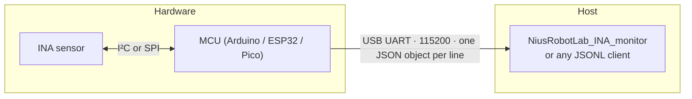

# INA Series Sensor

**Texas Instruments INA current & power monitors — production-ready Arduino library**  
**JSON Lines** on USB serial · Built for **NiusRobotLab_INA_monitor** (same protocol as the **INA Monitor** UI) · Plug-in examples per chip id

**[GitHub repository](https://github.com/NiusRobotLab/INA_series_sensor)**  ·  Arduino Library Manager uses this URL (`library.properties` `url`) to track releases.

[Why this library](#why-this-library) · [Architecture](#architecture) · [MCU support](#mcu-compatibility) · [Quick start](#quick-start) · [Protocol](#serial-protocol-json-lines)

**[Documentation](./docs/README.md)**  ·  [Usage](./docs/USAGE.md)  ·  [Wiring](./docs/WIRING.md)

---

## Why this library


|     |
| --- |
|     |


**All-in-one INA coverage**  
One codebase spans **INA219/220**, **INA226-class**, **INA228 digital I²C family**, **INA3221** (3-channel), **INA229** (SPI), **CH1-only** paths for INA2227 / INA423x, and an `**UNKNOWN`** stub — aligned with the **NiusRobotLab_INA_monitor** chip picker.


**NiusRobotLab_INA_monitor compatible**  
Baud **115200**, JSON field names (`bus_V`, `current_A`, `power_W`, `channels`…), and text commands (`PING`, `START`, `STOP`, `SR`, `IMAX`, `RSHUNT`) match the **NiusRobotLab_INA_monitor** host (INA Monitor UI) — **open serial → pick the same chip id as in the sketch → plot**. A public GitHub repo for the desktop app will be linked here when published.


**Lean & portable**  
Only `**Wire`**, `**SPI**`, and `**Serial**`. Shared `**InaJsonlProtocol**`, `**InaWireCompat**`, `**InaSpiCompat**` keep responses identical across **ESP32**, **Pico**, and **classic Arduino** cores.


**Examples for every UI id**  
Each **Examples** sketch maps **one** **NiusRobotLab_INA_monitor** device name — copy, wire, flash. Thin `**setup()` / `loop()`**; logic lives in typed bridge classes.


---

## Architecture




---

## MCU compatibility

The code uses standard Arduino APIs (`Serial`, `Wire`, `SPI`). Supported combinations:


| Platform                                                                                        | I²C                                                                   | SPI (INA229 examples)                                                     | Notes                                                                   |
| ----------------------------------------------------------------------------------------------- | --------------------------------------------------------------------- | ------------------------------------------------------------------------- | ----------------------------------------------------------------------- |
| **ESP32** (Arduino-ESP32)                                                                       | `Wire.begin(SDA, SCL)` via `beginI2c(sda, scl)`                       | `SPI.begin(SCK, MISO, MOSI, CS)` in `InaBridge229Spi`                     | Default example pins target **ESP32-C3** (e.g. GPIO8/9).                |
| **Raspberry Pi Pico / RP2040** ([Arduino-Pico](https://github.com/earlephilhower/arduino-pico)) | `Wire.begin(SDA, SCL)` with GPIO numbers                              | `InaSpiBeginMapped()` → `setRX` / `setTX` / `setSCK` + `SPI.begin(false)` | Match **GPx** labels on your board.                                     |
| **Classic Arduino** (AVR Uno/Nano, many ARM)                                                    | `InaWireBeginMapped()` → `Wire.begin()` on fixed I²C (**Uno: A4/A5**) | `InaSpiBeginMapped()` → `SPI.begin()` + software **CS**                   | Pin args in sketches may be ignored on AVR — wire to **real** bus pins. |


`InaWireCompat.h` and `InaSpiCompat.h` centralize peripheral setup so **one sketch** builds across targets.

---

## Example wiring

Sketches use `**Serial` @ 115200** baud, **I²C @ 400 kHz** by default, **7-bit address 0x40** unless `A0`/`A1` strapping differs.

### I²C — `beginI2c(8, 9)` (ESP32-C3: **GPIO8 = SDA**, **GPIO9 = SCL**)

Connect **SDA**, **SCL**, **3V3**, **GND**, and sense nodes per the TI datasheet.

**Full example list (click to expand)**


| Example folder      | INA / UI name | Library class   |
| ------------------- | ------------- | --------------- |
| `ina219_bridge`     | INA219        | `InaBridge219`  |
| `ina220_bridge`     | INA220        | `InaBridge219`  |
| `ina220_q1_bridge`  | INA220-Q1     | `InaBridge219`  |
| `ina226_bridge`     | INA226        | `InaBridge226`  |
| `ina226_q1_bridge`  | INA226-Q1     | `InaBridge226`  |
| `ina230_bridge`     | INA230        | `InaBridge226`  |
| `ina231_bridge`     | INA231        | `InaBridge226`  |
| `ina232_bridge`     | INA232        | `InaBridge226`  |
| `ina233_bridge`     | INA233        | `InaBridge226`  |
| `ina234_bridge`     | INA234        | `InaBridge226`  |
| `ina236_bridge`     | INA236        | `InaBridge226`  |
| `ina228_bridge`     | INA228        | `InaBridge228`  |
| `ina228_q1_bridge`  | INA228-Q1     | `InaBridge228`  |
| `ina237_bridge`     | INA237        | `InaBridge228`  |
| `ina237_q1_bridge`  | INA237-Q1     | `InaBridge228`  |
| `ina238_bridge`     | INA238        | `InaBridge228`  |
| `ina238_q1_bridge`  | INA238-Q1     | `InaBridge228`  |
| `ina239_bridge`     | INA239        | `InaBridge228`  |
| `ina239_q1_bridge`  | INA239-Q1     | `InaBridge228`  |
| `ina740x_bridge`    | INA740X       | `InaBridge228`  |
| `ina3221_bridge`    | INA3221       | `InaBridge3221` |
| `ina3221_q1_bridge` | INA3221-Q1    | `InaBridge3221` |
| `ina2227_bridge`    | INA2227       | `InaBridgeCh1`  |
| `ina4230_bridge`    | INA4230       | `InaBridgeCh1`  |
| `ina4235_bridge`    | INA4235       | `InaBridgeCh1`  |


**Other boards:** **Uno/Nano** → wire **A4/A5** (you can use `beginI2c(A4, A5)` for clarity). **Pico** → e.g. `beginI2c(8, 9)` → **GP8 / GP9** on many carriers.

### SPI — `InaBridge229Spi(..., CS, SCK, MISO, MOSI)` → `beginSpi()`

Default in sketches: `**InaBridge229Spi(chip, ref, 7, 4, 5, 6)`** → **CS=7**, **SCK=4**, **MISO=5**, **MOSI=6** (ESP32-C3).


| Example folder     | INA / UI name |
| ------------------ | ------------- |
| `ina229_bridge`    | INA229        |
| `ina229_q1_bridge` | INA229-Q1     |


On **ESP32** / **RP2040**, the four pins map the bus. On **AVR**, use hardware SPI (**D13/D12/D11**) and set **CS** in the constructor to match your wiring.

### Placeholder


| Example folder   | Wiring                                              |
| ---------------- | --------------------------------------------------- |
| `unknown_bridge` | None — `InaBridgeUnknown` (zeros only, UI testing). |


---

## Installation

1. Copy `**INA_series_sensor`** into your sketchbook `**libraries**` folder, e.g.
  **Windows:** `Documents\Arduino\libraries\INA_series_sensor`  
   **macOS / Linux:** `~/Arduino/libraries/INA_series_sensor`
2. Restart the Arduino IDE (or refresh the library index).
3. **File → Examples → INA Series Sensor** → pick the sketch for your part.

---

## Quick start

1. Board: e.g. **ESP32C3 Dev Module** for ESP32-C3 SuperMini.
2. Adjust `**beginI2c(sda, scl)`** if your wiring differs from **8 / 9**.
3. Upload; open Serial Monitor at **115200**.

**I²C**

```cpp
#include <INA_Series_Sensor.h>

static InaBridge228 g_bridge("INA228", 0x40);

void setup() {
  Serial.begin(115200);
  delay(100);
  g_bridge.beginI2c(8, 9);
}

void loop() {
  g_bridge.tick();
}
```

**SPI (INA229)**

```cpp
#include <INA_Series_Sensor.h>

static InaBridge229Spi g_bridge("INA229", "TI INA229", 7, 4, 5, 6);

void setup() {
  Serial.begin(115200);
  delay(100);
  g_bridge.beginSpi();
}

void loop() {
  g_bridge.tick();
}
```

---

## Library classes (`src/`)


| Class              | Typical devices                    | Notes                                                        |
| ------------------ | ---------------------------------- | ------------------------------------------------------------ |
| `InaBridge219`     | INA219, INA220                     | Calibration `0.04096`; JSON includes `shunt_uV`.             |
| `InaBridge226`     | INA226 family                      | Calibration `0.00512`; JSON includes `shunt_uV`.             |
| `InaBridge228`     | INA228, INA237/238/239, INA740X, … | MFG ID `0x5449` @ `0x3E`; pass the **exact** UI chip string. |
| `InaBridge3221`    | INA3221, INA3221-Q1                | `channels[3]` in JSON.                                       |
| `InaBridge229Spi`  | INA229, INA229-Q1                  | SPI only; JSON `addr` is `"SPI"`.                            |
| `InaBridgeCh1`     | INA2227, INA4230, INA4235          | CH1 registers; custom `infoMsg`.                             |
| `InaBridgeUnknown` | `UNKNOWN`                          | Placeholder readings.                                        |


```cpp
#include <INA_Series_Sensor.h>
```

Extend with `**InaJsonlProtocol.h**` for custom bridges so **PING / ACK / ERR** stay compatible.

---

## Serial protocol (JSON Lines)

- **Baud:** `115200`
- **Framing:** One JSON object per line (`\n`). Host uses `JSON.parse`.

### Boot / INFO

After `beginI2c()` / `beginSpi()` / `begin()`, an `**"type":"INFO"`** line identifies the bridge and address (**I²C** or `**"SPI"`**).

### Samples (after `START`)

Single-channel:

```json
{"v":1,"chip":"INA226","addr":"0x40","seq":0,"t_ms":12345,"bus_V":5.012345,"shunt_uV":1250.0,"current_A":0.123456,"power_W":0.618000}
```

Some classes omit `shunt_uV` (`InaBridge228`, `InaBridgeCh1`, `InaBridge229Spi`).

INA3221-style:

```json
{"v":1,"chip":"INA3221","addr":"0x40","seq":0,"t_ms":12345,"bus_V":5.012345,"channels":[{"bus_V":5.0,"current_A":0.1,"power_W":0.5},...]}
```

Do **not** rename fields used by **NiusRobotLab_INA_monitor**: `**bus_V`**, `**shunt_uV**`, `**current_A**`, `**power_W**`, `**channels**`, `**chip**`, `**addr**`, `**seq**`, `**t_ms**`.

### Control commands (host → device, line-terminated)


| Command        | Action                                        |
| -------------- | --------------------------------------------- |
| `PING`         | `{"v":1,"type":"PONG"}`                       |
| `START`        | Enable streaming                              |
| `STOP`         | Disable streaming                             |
| `SR <hz>`      | Sample rate **1–200** Hz                      |
| `IMAX <A>`     | Max current for calibration (where supported) |
| `RSHUNT <ohm>` | Shunt resistance                              |


Unknown commands → `**ERR`** JSON. Some bridges omit `**IMAX**` (e.g. `InaBridge3221`, `InaBridgeCh1`).

---

## NiusRobotLab_INA_monitor (host UI)

Use the **Serial** data source in **NiusRobotLab_INA_monitor** (the application window title / branding may show **INA Monitor**). Select the **same `chip` string** as in your sketch constructor, then start streaming. The host sends `**START` / `STOP` / `SR`** and calibration lines as needed.

**Desktop application source:** a public GitHub repository for **NiusRobotLab_INA_monitor** is not published yet; this README will add the link when it is available.

---

## Maintenance script

Regenerate thin examples from the internal table:

```bash
node scripts/wire-examples-library.mjs
```

---

## Maintainer

**NiusRobotLab** — see `library.properties`.

INA Series Sensor · Arduino Library 1.5 · [GitHub](https://github.com/NiusRobotLab/INA_series_sensor) · JSONL for NiusRobotLab_INA_monitor